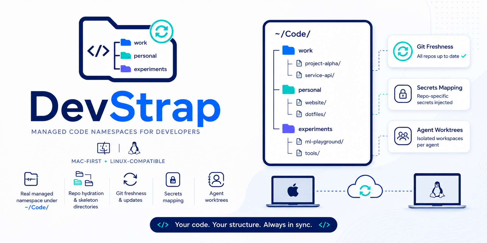
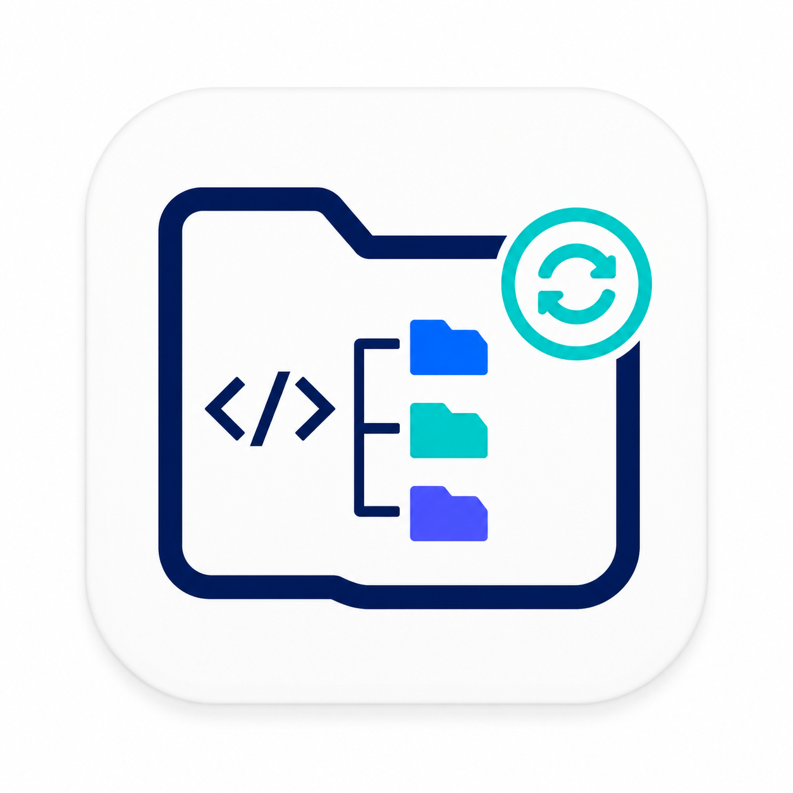

<div align="center">



<h1>DevStrap</h1>

<strong>Your code. Your structure. Always in sync.</strong>

<p>
A local-first <em>Workspace Passport</em>: one identical <code>~/Code</code> namespace on every machine and AI agent —
built on Git, SQLite, and age‑encrypted secrets, <em>not</em> a magic filesystem.
</p>

<p>
<a href="https://github.com/Reederey87/DevStrap/actions/workflows/ci.yml"></a>
<a href="https://goreportcard.com/report/github.com/Reederey87/DevStrap"></a>


<a href="LICENSE"></a>

</p>

</div>

---

## What is DevStrap?

DevStrap gives you a **portable, managed code namespace** — the *Workspace Passport* — that appears identically on every device you work from: your Mac, a Linux box, a cloud VM, or an AI agent runner.

The idea is deliberately boring and robust: `~/Code` is a **real folder**, and DevStrap keeps its structure consistent everywhere using developer‑native tools underneath — **not** a FUSE/virtual filesystem.

- **Git** owns repository contents (cloned on demand, `--filter=blob:none`).
- **SQLite** owns the local namespace map and workspace state.
- **Secrets** are referenced (1Password) or **age‑encrypted**, never blindly copied.
- **Agents** always start from a **fresh worktree off the fetched remote default branch** — never a stale local branch.

> **Install DevStrap on a new machine → point it at `~/Code` → authenticate Git + secrets → run `devstrap sync` once → the whole tree is reconstructed.** Every repo is blobless‑cloned from its existing remote, env/draft folders are pulled as encrypted blobs, and `node_modules`/build artifacts are rebuilt, never synced.

## Table of contents

- [Why DevStrap?](#why-devstrap)
- [How it works](#how-it-works)
- [Features](#features)
- [Project status](#project-status)
- [Requirements](#requirements)
- [Install](#install)
- [Quickstart](#quickstart)
- [Command reference](#command-reference)
- [Architecture](#architecture)
- [Documentation](#documentation)
- [Roadmap](#roadmap)
- [Security](#security)
- [Contributing](#contributing)
- [License](#license)

## Why DevStrap?

Moving between machines and handing work to AI agents breaks in predictable ways:

- Your `~/Code` layout drifts from one machine to the next.
- Repos are cloned ad‑hoc into inconsistent paths.
- `.env` files get copied around in plaintext (or lost).
- "I forgot to push" strands work on the wrong box.
- Agents branch from a **stale local `main`** and open PRs against the wrong base.

DevStrap fixes these without a heavyweight sync daemon or a virtual filesystem. It treats your code namespace as **managed state** — a signed, append‑only event log of *where every project lives, what its remote is, and which env profile it uses* — and reconstructs the real tree from that map plus Git's own transport.

## How it works

File‑sync is **split by content type** — DevStrap never blanket‑syncs a folder, and never file‑syncs `.git` (which would corrupt the repo):

| Content | Transport |
|---|---|
| **Repo content** | `git clone --filter=blob:none` / fetch from its existing remote — rides Git's transport, never touches the hub |
| **Env vars + non‑git/draft folders** | age‑encrypted, content‑addressed `age_blob:<sha256>` bundles |
| **The map of all projects** | a signed, [HLC](https://cse.buffalo.edu/tech-reports/2014-04.pdf)‑ordered append‑only event log (the "namespace map") |
| **`node_modules` / build artifacts** | **never synced** — rebuilt on hydrate |

Materialization is **eager**: after `devstrap sync`, the whole `~/Code` tree is really present on disk. There is no placeholder/lazy‑VFS magic — a true virtual filesystem (StrapFS) is explicitly deferred.

```text
1. Add or create a project on Machine A.
2. DevStrap records it in the signed namespace map (path, remote, env profile, policy).
3. Machine B runs `devstrap sync` and pulls the map.
4. Sync eagerly materializes the tree: blobless-clone each repo, pull encrypted env/draft blobs, hydrate env.
5. The same folder paths are really present on disk.
6. Agent work starts from a fresh remote default branch — not a stale local one.
```

## Features

- 🗂️ **Real managed namespace** under `~/Code` — owned structure + metadata, not a mounted illusion.
- 💧 **Repo hydration & skeleton directories** — projects exist as lightweight skeletons until materialized; `sync`/`materialize` blobless‑clone them eagerly.
- 🔄 **Git freshness** — partial clone, LFS policy, authoritative default‑branch resolution, stale‑base detection.
- 🔐 **Secrets mapping** — repo‑specific env profiles, age‑encrypted at rest or referenced from 1Password; subprocesses get a sanitized, no‑secret‑leak environment.
- 🤖 **Agent worktrees** — every agent task runs in an isolated worktree off the fetched remote default branch, with a wrapper‑level command/file policy and forge‑aware PR/MR creation (`gh`/`glab`/`tea`).
- 🧰 **Mac‑first, Linux‑compatible** — one portable Go binary; platform behavior sits behind adapters.
- 🛰️ **Zero‑knowledge sync hub** — a two‑plane hub (signed event log + content‑addressed encrypted blob store) through **any private git repo you can already push to** (zero infrastructure) or Cloudflare R2/S3, behind one pluggable `Hub` interface.

## Project status

> **Alpha, but shipping.** Tagged releases (`v0.1.1` latest) are published with a **verifiable supply chain** — Homebrew cask, `curl | sh` installer, cosign keyless signatures, SLSA build provenance, and per‑archive SBOMs. The local engine, the agent loop, and multi‑device sync are all shipped and tested; `devstrap sync` talks to any of three hub backends.

**Shipped**

- Phase 0 local CLI: `init`, `scan`/`add`/`hydrate`/`open`, `worktree`, `env`, `run`, `status`, `doctor`, `db` (incl. `backup --full`/`restore`), `devices`, `conflicts`, `keys`.
- Phase 3 agent loop: fresh‑worktree `agent run` inside an **OS‑enforced sandbox** (macOS Seatbelt; Linux bubblewrap/Landlock + a seccomp denylist), recorded logs, base‑gated `agent pr` with forge‑aware routing.
- Multi‑device sync: **eager materialization** (`sync`/`materialize`), **encrypted draft bundles** + `.devstrapignore` compiler (`draft`), **cross‑device env‑profile exchange** and **synced device‑trust propagation**, event‑log **compaction + snapshot bootstrap**, and a portable **`run-loop`** with a `devstrap service install` (launchd/systemd) wrapper for unattended convergence.
- Three hub backends behind one `Hub` interface: the zero‑infrastructure **git carrier** (`hub init <git-url>` — any private git repo, no bucket, no credentials plane), a **local‑folder/cloud‑drive carrier**, and **R2/S3** (`hub: r2://<bucket>` + `DEVSTRAP_HUB_S3_*`).
- Hardened internals: sanitized child env, value‑level secret redaction, partial clone with retry classification, WAL SQLite with single‑writer pool, HLC event ordering with property‑tested convergence, age X25519 + Ed25519 device identities in the OS keychain (file‑store fallback for headless/CI), per‑epoch workspace content keys with pairing‑code device enrollment.

**Not yet implemented**

- The local daemon, FSEvents‑specific Mac watcher, and an HTTP/SSE relay (the daemonless `run-loop` + `service` cover unattended sync today).
- A **hosted managed‑hub tier** — a DevStrap‑operated hub with zero setup, on a free‑with‑limits + subscription model. This is a plan, not a feature; see [`spec/20_COMMERCIALIZATION_AND_PRICING.md`](spec/20_COMMERCIALIZATION_AND_PRICING.md). The CLI and self‑hosting your own hub are free and open‑source **forever**.
- Optional StrapFS (a lazy virtual filesystem) — deliberately deferred.

A standing design/implementation audit drives the backlog. All passes are archived under [`docs/audits/`](docs/audits/) — see the [index & open backlog](docs/audits/README.md). The latest is the seventh pass, [`AUDIT_RECOMMENDATIONS_2026-07-10_PASS7.md`](docs/audits/AUDIT_RECOMMENDATIONS_2026-07-10_PASS7.md) (47 findings); Pass 6 is fully closed (43/43).

## Requirements

- **macOS or Linux**
- **Go 1.26+** (to build from source)
- **Git**
- **GitHub CLI (`gh`)** — and optionally `glab`/`tea` — for PR/MR creation

Optional:

- **1Password CLI (`op`)** for secret‑provider mode (`env bind` / `run`).
- **Cursor** or **VS Code** command‑line launchers for `devstrap open`.

## Install

The two happy paths:

```bash
# Homebrew (macOS and Linux) — installs a cask + bash/zsh/fish completions
brew install Reederey87/devstrap/devstrap

# or the one-line installer — verifies against checksums.txt before extracting, no sudo
curl -fsSL https://raw.githubusercontent.com/Reederey87/DevStrap/main/scripts/install.sh | sh
```

Then `devstrap version` to confirm. Release binaries + checksums, cosign signature and SBOM
verification, `go install …@main`, and build-from-source are all covered in
**[docs/install.md](docs/install.md)**.

## Quickstart

The zero-infrastructure default loop — any private git repo you can push to *is* the hub:

```bash
devstrap init ~/Code --workspace-name personal   # 1. found a managed workspace
devstrap scan ~/Code --adopt                      # 2. adopt the repos already on disk
devstrap status                                   # 3. see what DevStrap manages
gh repo create you/devstrap-hub --private         # 4. an empty private repo = the hub
devstrap hub init git@github.com:you/devstrap-hub.git   # 5. point at it (writes config.yaml)
devstrap sync                                     # 6. push the map + materialize the tree
devstrap open <any-managed-path> --cursor         # 7. the folders are really on disk now
devstrap run-loop                                 # 8. optional: converge on an interval, no daemon
```

Load your SSH key first (`ssh-add ~/.ssh/<key>`) — git runs non-interactively. For a
shared-folder or S3/R2 hub, pairing a second device, and the full agent loop, see
**[docs/quickstart.md](docs/quickstart.md)**; for choosing and operating a hub, see
**[docs/self-hosting.md](docs/self-hosting.md)**.

Prefer not to install? Every command also works via `go run ./cmd/devstrap <cmd> …`.

## Command reference

| Command | Description |
|---|---|
| `devstrap init` | Initialize a DevStrap workspace |
| `devstrap status` | Show local workspace status (`--json` supported) |
| `devstrap doctor` | Check local prerequisites |
| `devstrap scan` | Scan a workspace root for projects (`--adopt`, `--quarantine`) |
| `devstrap clone` | Clone a repo into the namespace and materialize it in one command (`--open`/`--vscode`) |
| `devstrap add` | Add a Git repository to the namespace |
| `devstrap hydrate` | Clone a skeleton Git repository |
| `devstrap open` | Hydrate and open a namespace path in an editor (`--cursor`/`--code`) |
| `devstrap materialize` | Eagerly materialize skeleton projects (clone repos, hydrate env) |
| `devstrap sync` | Push/pull namespace events and materialize the tree (hub from config: `hub: git@github.com:you/hub.git` — any private git repo, the zero-infra default — or `hub: r2://<bucket>`; `--hub-file <path>` overrides for local tests) |
| `devstrap run-loop` | Run scan + sync + materialize on an interval (portable, no daemon) |
| `devstrap worktree` | Manage isolated worktrees (`new`/`status`/`finalize`/`list`/`remove`/`cleanup`/`unlock`) |
| `devstrap agent` | Run agents in isolated fresh worktrees inside an OS sandbox (`run`/`list`/`show`/`pr`; `--sandbox`, `--read-confine`) |
| `devstrap env` | Manage project environment profiles (`capture`/`hydrate`/`bind`/`rotate`) |
| `devstrap run` | Run a command with the project env profile injected |
| `devstrap draft` | Manage non‑git draft project content sync (`snapshot`) |
| `devstrap hub` | Operate on the sync hub (`init` configures a git carrier; `compact`/`gc`/`migrate-events`/`login` operate it) |
| `devstrap keys` | Manage the workspace content key (WCK) epochs (`rotate`) |
| `devstrap devices` | Manage device trust state (`list`/`approve`/`revoke`/`lost`/`rename`/`enroll`/`pairing-code`) |
| `devstrap conflicts` | Inspect and resolve namespace conflicts (`list`/`show`/`resolve`) |
| `devstrap service` | Install the `run-loop` as a background OS service (`install`/`uninstall`/`status`) |
| `devstrap db` | Manage the local state database (`migrate`/`status`/`backup [--full]`/`restore`/`down`) |
| `devstrap version` | Print build version |

Run `devstrap <command> --help` for flags and subcommands.

## Architecture

DevStrap is a Mac‑first, Linux‑compatible **managed physical namespace** — not a virtual filesystem.

```text
~/Code                          user-visible managed tree (real folders)
~/.devstrap/state.db            local SQLite state (WAL, 0600)
~/.devstrap/blobs/              age-encrypted env/draft blobs (0600)
~/.devstrap/keys/               device identities (keychain preferred; file fallback)
~/.devstrap/worktrees/          managed agent/human worktrees
~/.devstrap/devstrapd.sock      future local daemon socket
```

Components:

- **`devstrap`** — the CLI for workspace setup, status, hydration, worktrees, env, sync, and sandboxed agents (shipped).
- **`devstrap service`** — installs the `run-loop` as a launchd/systemd background service for unattended convergence (shipped); a native `devstrapd` daemon with an FSEvents watcher and local API is still planned.
- **DevStrap Hub** — a two‑plane zero‑knowledge sync service: a signed HLC namespace‑map event log plus a content‑addressed encrypted blob store, through any private git repo (the zero‑infra carrier), a local‑folder/cloud‑drive carrier, or Cloudflare R2/S3, behind one pluggable `Hub` interface (shipped; a hosted control plane for a managed tier is planned — [`spec/20`](spec/20_COMMERCIALIZATION_AND_PRICING.md)).

Start with **[ARCHITECTURE.md](ARCHITECTURE.md)** for the big picture — why a managed physical
namespace, how the two‑plane hub works, and what is deliberately not built. The full design
corpus lives under [`spec/`](spec/), beginning with [`spec/00_START_HERE.md`](spec/00_START_HERE.md).

## Documentation

- **[docs/](docs/)** — user guides: [install.md](docs/install.md), [quickstart.md](docs/quickstart.md),
  and [self-hosting.md](docs/self-hosting.md) (choosing and operating a hub).
- **[ARCHITECTURE.md](ARCHITECTURE.md)** — the big picture, bridging this README and the spec.
- **[`spec/`](spec/)** — the design corpus (one file per subsystem); depth pointers throughout ARCHITECTURE.md.
- **[docs/audits/](docs/audits/)** — the standing design/implementation audit archive and open backlog.

## Roadmap

Capability layers (see [`spec/14_MVP_ROADMAP_AND_BACKLOG.md`](spec/14_MVP_ROADMAP_AND_BACKLOG.md) for the canonical, re‑ordered sequencing):

1. **Local CLI proof** — scan, register, hydrate, fresh worktrees, env profiles. ✅
2. **Agent workspaces** — one worktree per task, fresh remote base, logs, forge‑agnostic PR/MR, OS‑enforced sandbox. ✅
3. **Multi‑device sync** — eager materialization, encrypted draft/env blobs, device‑trust propagation, compaction + snapshot bootstrap, the zero‑knowledge hub (git/folder carriers + R2/S3). ✅
4. **Unattended operation** — `run-loop` + `devstrap service install` (launchd/systemd). ✅ · a native daemon + FSEvents watcher remain ⏳
5. **Hosted managed tier** — a DevStrap‑operated hub + control plane; a plan, see [`spec/20`](spec/20_COMMERCIALIZATION_AND_PRICING.md). ⏳
6. **Optional StrapFS** — File Provider / FUSE evaluation. ⏳ (deliberately deferred)

The near‑term priorities — captured across the [audit archive](docs/audits/) (latest: the [seventh pass](docs/audits/AUDIT_RECOMMENDATIONS_2026-07-10_PASS7.md)) — are to close the revocation‑survives‑compaction gap (`P7-SYNC-01`), harden backup/restore atomicity and the new hub carriers' durability, and build the minimal control plane that a managed tier requires.

## Security

DevStrap is built so the sync hub is **zero‑knowledge**: repo content rides Git's own transport and never reaches the hub, the namespace‑map event log is envelope‑encrypted under a per‑epoch workspace content key, and env/draft content is **age‑encrypted client‑side** into content‑addressed blobs. Device identities are age X25519 + Ed25519 keypairs kept in the OS keychain (with a `0600` file fallback for headless/CI); new devices enroll through an out‑of‑band fingerprint / pairing‑code ceremony, and secret values are redacted from logs, errors, and event payloads. Agent runs execute inside an OS‑enforced sandbox, and releases are cosign‑signed with SLSA provenance you can verify yourself (see [docs/install.md](docs/install.md)).

Please report vulnerabilities privately per [SECURITY.md](SECURITY.md). The threat model is documented in [`spec/15_SECURITY_THREAT_MODEL.md`](spec/15_SECURITY_THREAT_MODEL.md); known hardening gaps are tracked as `SEC-*` findings in the [latest audit](docs/audits/AUDIT_RECOMMENDATIONS_2026-07-10_PASS7.md).

## Contributing

Contributions are welcome! Before changing behavior, read [`spec/00_START_HERE.md`](spec/00_START_HERE.md) and the relevant spec file, and follow the agent/maintainer guidance in [AGENTS.md](AGENTS.md).

DevStrap uses **trunk‑based development**: `main` is the single protected default branch (there is **no** `dev` branch). All changes land via pull request to `main`; external contributors fork and open a PR, maintainers branch from the fetched `origin/main`. Agents and worktrees always base from the fetched `origin/main`, never a local branch. `main` is protected — PRs require green CI (Spec drift, Go lint, Go tests on macOS + Linux, Vulnerability check), resolved conversations, and linear history.

Before opening a PR:

```bash
gofmt -w cmd internal
golangci-lint run
go run ./cmd/spec-drift --base origin/main --head HEAD
go test -race ./...
```

Keep changes aligned with the safety invariants: never overwrite dirty worktrees, never log secrets, keep Mac‑specific behavior behind adapters, and never branch agent work from a stale local default branch. Add focused tests for anything touching Git, secrets, filesystem reconciliation, or destructive actions. See [CONTRIBUTING.md](CONTRIBUTING.md) for details.

## License

DevStrap is licensed under the [MIT License](LICENSE).

---

<div align="center">
<sub>&nbsp; <strong>DevStrap</strong> — your code, your structure, always in sync.</sub>
</div>
